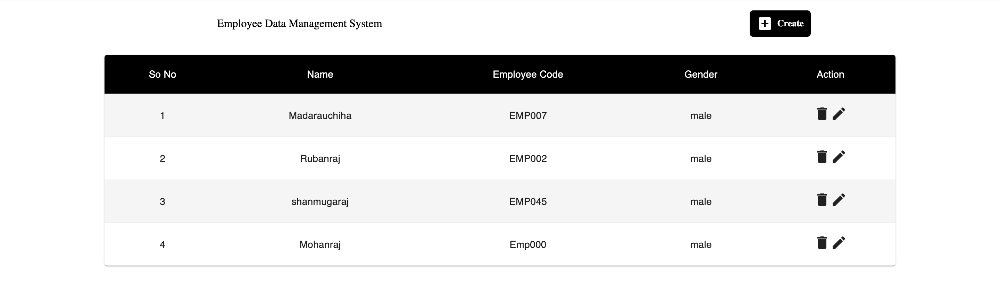

## Employee Management System - React Version

- Welcome to the Employee Management System! This system allows you to perform basic CRUD operations (Create, Read, Update, Delete) on employee data through an API. The frontend is built entirely with React.

Note: This application need an localhost jason database to run.

## Screenshot of UI

## Features

- Data linked with api.
- Create an employee data.
- Edit an employee data.
- Delete an employee data.

## HAPPY CODING!!!
